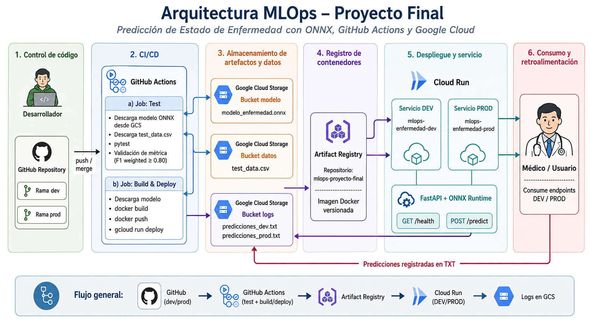

# MLOps · Predicción de Estado de Enfermedad con ONNX

**Universidad Icesi — Maestría en Inteligencia Artificial Aplicada**
**Proyecto Final · MLOps**

- **Repositorio:** https://github.com/poppetmaster/proyecto-final-mlops-onnx-enfermedad
- **Proyecto GCP:** `mlops-proyecto-final-grupo-2`
- **Región:** `us-central1`

## Integrantes del equipo

| Nombre | Correo | Usuario GitHub |
|:---|:---|:---|
| Rubén Darío Sabogal Urbano | 16704992@u.icesi.edu.co | [@rubenesticesi](https://github.com/rubenesticesi) |
| Cristian Quebrada | criistianq90@gmail.com | [@cris-bytes](https://github.com/cris-bytes) |
| Edwin Pérez Lozano | edwinandperez@gmail.com | [@poppetmaster](https://github.com/poppetmaster) |

---

## Estado actual del despliegue

| Elemento | Estado |
|---|---|
| Rama `dev` | Despliegue automático funcional |
| Rama `prod` | Despliegue automático funcional |
| GitHub Actions | Ejecuta `test` y `build-promote` |
| Modelo ONNX | Almacenado en GCS, no en GitHub |
| Test data | Almacenado en GCS, no en GitHub |
| Artifact Registry | `mlops-proyecto-final` |
| Imagen Docker | `mlops-enfermedad` |
| Cloud Run DEV | `mlops-enfermedad-dev` |
| Cloud Run PROD | `mlops-enfermedad-prod` |
| Logs DEV | `predicciones_dev.txt` en GCS |
| Logs PROD | `predicciones_prod.txt` en GCS |
| Pruebas unitarias | 17 passed |
| Métrica validada | F1 weighted ≥ 0.80 |
| Docker build | Exitoso |
| Deploy Cloud Run | Exitoso |

---

## 1. Descripción del proyecto

Pipeline MLOps end-to-end para una API de predicción de estado de enfermedad
basada en datos clínicos. El modelo es un `RandomForestClassifier` exportado a
**ONNX** que se sirve a través de **FastAPI** sobre **Google Cloud Run**, con
dos ambientes (`dev` / `prod`), entrega continua mediante **GitHub Actions** y
artefactos versionados en **Google Cloud Storage**.

### Características clave

| Capacidad | Implementación |
|---|---|
| Modelo en formato portable | ONNX (onnxruntime, sin dependencia de sklearn en runtime) |
| Artefactos fuera del repo | Modelo y datos de prueba viven en GCS |
| CI/CD por rama | `dev` → Cloud Run DEV · `prod` → Cloud Run PROD |
| Validación de calidad | F1 weighted ≥ 0.80 antes de promover |
| Trazabilidad | Cada predicción registrada en GCS con timestamp y UUID |
| Despliegue serverless | Cloud Run con autoscaling de 0 a N |

### Cumplimiento del enunciado

| Requisito | Implementado |
|---|---|
| Repositorio GitHub | ✅ |
| Ramas `dev` y `prod` | ✅ |
| Endpoint por rama (Cloud Run) | ✅ |
| Pipeline CI/CD con GitHub Actions | ✅ |
| Etapa `test` | ✅ |
| Etapa `build-promote` | ✅ |
| Modelo ONNX fuera del repo | ✅ |
| Datos de prueba fuera del repo | ✅ |
| Imagen Docker | ✅ |
| Despliegue real en Cloud Run | ✅ |
| Logs TXT de predicciones en GCS | ✅ |

---

## 2. Arquitectura

La siguiente arquitectura resume el flujo completo del proyecto MLOps, desde el control de código en GitHub hasta el despliegue en Cloud Run y el registro de predicciones en Google Cloud Storage.


### Descripción general del flujo

1. **Control de código**
   - El desarrollo se gestiona en un repositorio GitHub con dos ramas principales:
     - `dev`
     - `prod`

2. **CI/CD con GitHub Actions**
   - Cada `push` a `dev` o `prod` dispara el pipeline.
   - El pipeline ejecuta dos etapas principales:
     - **Test**: descarga el modelo ONNX y los datos de prueba desde GCS, ejecuta `pytest` y valida la métrica del modelo.
     - **Build & Deploy**: descarga el modelo, construye la imagen Docker, la publica en Artifact Registry y despliega el servicio en Cloud Run.

3. **Almacenamiento de artefactos y datos**
   - El modelo `modelo_enfermedad.onnx` se almacena en un bucket de Google Cloud Storage.
   - El archivo `test_data.csv` también se almacena en GCS.
   - Los logs de predicción se almacenan como:
     - `predicciones_dev.txt`
     - `predicciones_prod.txt`

4. **Registro de contenedores**
   - Las imágenes Docker se almacenan en **Artifact Registry** dentro del repositorio:
     - `mlops-proyecto-final`

5. **Despliegue y servicio**
   - Se despliegan dos servicios en **Cloud Run**:
     - `mlops-enfermedad-dev`
     - `mlops-enfermedad-prod`
   - La API está implementada con **FastAPI + ONNX Runtime**.
   - Endpoints principales:
     - `GET /health`
     - `POST /predict`

6. **Consumo y retroalimentación**
   - El médico o usuario consume los endpoints del ambiente correspondiente.
   - Cada predicción realizada se registra en archivos TXT en GCS, permitiendo trazabilidad y evidencia del funcionamiento.

---

## 3. Artefactos excluidos del repositorio

Por requerimiento del proyecto, estos archivos **no están versionados en GitHub**:

| Artefacto | Razón |
|---|---|
| `modelo_enfermedad.onnx` | Binario de ML — almacenado en GCS |
| `test_data.csv` | Datos de prueba — almacenados en GCS |
| Credenciales JSON de GCP | Seguridad — gestionadas como GitHub Secret |

Estos artefactos se descargan automáticamente durante las etapas `test` y
`build-promote` del pipeline. El `.gitignore` excluye explícitamente `*.onnx`,
`*.csv`, `artifacts/`, `models/`, `data/` y archivos `*.json` de credenciales.

---

## 4. Ramas y entornos

| Rama | Cloud Run Service | Umbral F1 | Imagen tag |
|---|---|---|---|
| `dev` | `mlops-enfermedad-dev` | ≥ 0.80 | `dev` |
| `prod` | `mlops-enfermedad-prod` | ≥ 0.80 | `prod` |

> El umbral 0.80 aplica a **ambos ambientes**, tal como está configurado en el
> workflow (`METRIC_THRESHOLD: "0.80"`). Elevar el umbral de `prod` es una
> mejora futura recomendada, pero no está implementada actualmente.

El pipeline se dispara con `git push` a cualquiera de las dos ramas y
selecciona automáticamente el servicio Cloud Run correspondiente.

---

## 5. Modelo ONNX

- **Algoritmo:** `RandomForestClassifier` (sklearn) → exportado con `skl2onnx`
- **Features de entrada:** `num_sintomas`, `dias_sintomas`, `nivel_dolor`,
  `tiene_fiebre`, `enfermedad_base`, `edad`
- **Clases de salida:** 0=NO ENFERMO · 1=LEVE · 2=AGUDA · 3=CRÓNICA · 4=TERMINAL
- **Runtime de inferencia:** `onnxruntime` con `CPUExecutionProvider`
- **Archivo:** `modelo_enfermedad.onnx` — almacenado en GCS, nunca en el repo

Para generar el modelo localmente:

```bash
python scripts/train_export_onnx.py
# Genera: artifacts/modelo_enfermedad.onnx  y  artifacts/test_data.csv
```

Subir a GCS (usar el nombre real del bucket configurado en `GCS_MODEL_BUCKET`):

```bash
gcloud storage cp artifacts/modelo_enfermedad.onnx gs://$GCS_MODEL_BUCKET/
gcloud storage cp artifacts/test_data.csv          gs://$GCS_DATA_BUCKET/
```

---

## 6. Buckets de Google Cloud Storage

El workflow usa **un único conjunto de buckets** compartido entre `dev` y `prod`,
configurados como GitHub Secrets sin sufijo de ambiente:

| Propósito | Secret GitHub | Contenido |
|---|---|---|
| Modelo ONNX | `GCS_MODEL_BUCKET` | `modelo_enfermedad.onnx` |
| Datos de prueba | `GCS_DATA_BUCKET` | `test_data.csv` |
| Logs de predicciones | `GCS_LOGS_BUCKET` | `predicciones_dev.txt` / `predicciones_prod.txt` |

> Los archivos de log se diferencian por nombre dentro del mismo bucket:
> `predicciones_dev.txt` y `predicciones_prod.txt`.

Crear los buckets (reemplazar con los nombres reales usados en el proyecto):

```bash
gcloud storage buckets create gs://mlops-grupo2-modelos --location=us-central1
gcloud storage buckets create gs://mlops-grupo2-data  --location=us-central1
gcloud storage buckets create gs://mlops-grupo2-logs   --location=us-central1
```

---

## 7. GitHub Actions — Pipeline CI/CD

El workflow `.github/workflows/ci-cd.yml` se dispara con `push` a `dev` o
`prod` y ejecuta dos jobs en secuencia.

### Variables de entorno globales del workflow

Estas variables están definidas en el bloque `env:` del YAML y son las mismas
para ambas ramas:

| Variable | Valor real en el YAML |
|---|---|
| `PYTHON_VERSION` | `3.11` |
| `GCP_REGION` | `us-central1` |
| `ARTIFACT_REGISTRY_REPO` | `mlops-proyecto-final` |
| `IMAGE_NAME` | `mlops-enfermedad` |
| `METRIC_THRESHOLD` | `0.80` |
| `METRIC_NAME` | `f1_weighted` |

### URL completa de la imagen en Artifact Registry

```
us-central1-docker.pkg.dev/mlops-proyecto-final-grupo-2/mlops-proyecto-final/mlops-enfermedad:<tag>
```

Donde `<tag>` es `dev` o `prod` según la rama, y adicionalmente se publica
con el SHA del commit para trazabilidad.

### Secrets de GitHub requeridos

Los siguientes secrets deben estar configurados en **Settings → Secrets and
variables → Actions** del repositorio. Estos son los únicos secrets que usa
el workflow — ni más ni menos:

| Secret | Descripción |
|---|---|
| `GCP_SERVICE_ACCOUNT_KEY` | JSON completo de la Service Account de GCP |
| `GCP_PROJECT_ID` | ID del proyecto GCP (`mlops-proyecto-final-grupo-2`) |
| `GCS_MODEL_BUCKET` | Nombre del bucket GCS que contiene `modelo_enfermedad.onnx` |
| `GCS_DATA_BUCKET` | Nombre del bucket GCS que contiene `test_data.csv` |
| `GCS_LOGS_BUCKET` | Nombre del bucket GCS donde se registran las predicciones |

> ✅ Esta tabla coincide exactamente con los secrets referenciados en
> `ci-cd.yml`. No se usan variantes `_DEV` / `_PROD`.

### Job 1 — `test`

1. Checkout del repositorio
2. Setup Python 3.11 + instalación de `requirements.txt`
3. Detección del ambiente según rama (`dev` o `prod`)
4. Autenticación en GCP con `GCP_SERVICE_ACCOUNT_KEY`
5. Descarga del modelo desde `GCS_MODEL_BUCKET` → `models/modelo_enfermedad.onnx`
6. Descarga de test data desde `GCS_DATA_BUCKET` → `data/test_data.csv`
7. Ejecución de `pytest tests/ -v --tb=short` → **17 tests**
8. Ejecución de `scripts/validate_model.py` → valida F1 weighted ≥ 0.80

### Job 2 — `build-promote` (depende de `test`)

1. Checkout del repositorio
2. Detección del ambiente y selección del servicio Cloud Run correspondiente
3. Autenticación en GCP
4. Configuración de Docker para Artifact Registry (`us-central1-docker.pkg.dev`)
5. Descarga del modelo ONNX desde `GCS_MODEL_BUCKET` (para incluirlo en la imagen)
6. `docker build` — etiqueta con `dev`/`prod` y SHA del commit
7. `docker push` a Artifact Registry
8. `gcloud run deploy` al servicio `mlops-enfermedad-dev` o `mlops-enfermedad-prod`
9. Variables inyectadas en Cloud Run: `ENVIRONMENT`, `MODEL_VERSION`,
   `MODEL_PATH`, `GCS_LOGS_BUCKET`, `PREDICTIONS_FILE`

---

## 8. Pruebas

### Estructura de tests

| Archivo | Qué valida | Tests |
|---|---|---|
| `tests/test_inference.py` | Carga del modelo ONNX y respuesta con entradas definidas | 6 |
| `tests/test_api.py` | Endpoints `/health`, `/model-info` y `/predict` | 7 |
| `tests/test_metrics.py` | F1 weighted ≥ 0.80 sobre `test_data.csv` | 4 |
| **Total** | | **17** |

### Ejecutar localmente

```bash
export MODEL_PATH=artifacts/modelo_enfermedad.onnx
export TEST_DATA_PATH=artifacts/test_data.csv
export ENVIRONMENT=local

pytest tests/ -v
```

---

## 9. Métrica y umbral

| Métrica | Umbral mínimo | Aplica a |
|---|---|---|
| **F1 weighted** | **≥ 0.80** | `dev` y `prod` |
| Accuracy | Referencial | No bloquea el pipeline |

Si la validación falla, el pipeline se detiene y el job `build-promote` **no
se ejecuta**. El modelo actual alcanza F1 weighted ≈ 0.86 sobre el conjunto
de prueba generado por `scripts/train_export_onnx.py`.

---

## 10. Endpoints

### Obtener URLs reales de Cloud Run

Las URLs se generan automáticamente al hacer el primer deploy. Para consultarlas:

```bash
gcloud run services describe mlops-enfermedad-dev \
  --region=us-central1 --format="value(status.url)"

gcloud run services describe mlops-enfermedad-prod \
  --region=us-central1 --format="value(status.url)"
```

También aparecen en el **summary de GitHub Actions** al final de cada
ejecución del workflow.

### Lista de endpoints disponibles

| Método | Path | Descripción |
|---|---|---|
| GET | `/` | Página HTML de bienvenida con info del entorno |
| GET | `/health` | Health check (usado por Cloud Run) |
| GET | `/model-info` | Versión, features y clases del modelo |
| GET | `/docs` | Documentación interactiva Swagger UI |
| POST | `/predict` | Predicción de estado de enfermedad |

---

## 11. Ejecución local

### Opción A — Sin Docker (Linux / Mac)

```bash
# 1. Crear entorno virtual e instalar dependencias
python3 -m venv .venv
source .venv/bin/activate
pip install -r requirements.txt

# 2. Generar modelo y test data
python scripts/train_export_onnx.py

# 3. Configurar variables de entorno
export MODEL_PATH=artifacts/modelo_enfermedad.onnx
export TEST_DATA_PATH=artifacts/test_data.csv
export ENVIRONMENT=local
export MODEL_VERSION=v1.0.0-local

# 4. Iniciar la API
uvicorn app.main:app --host 0.0.0.0 --port 8080
```

### Opción A — Sin Docker (Windows CMD)

```cmd
python -m venv .venv
.venv\Scripts\activate
pip install -r requirements.txt

python scripts/train_export_onnx.py

set MODEL_PATH=artifacts/modelo_enfermedad.onnx
set TEST_DATA_PATH=artifacts/test_data.csv
set ENVIRONMENT=local
set MODEL_VERSION=v1.0.0-local

uvicorn app.main:app --host 0.0.0.0 --port 8080
```

Visitar: http://localhost:8080 · Swagger: http://localhost:8080/docs

### Opción B — Con Docker (Linux / Mac)

```bash
# 1. Generar el modelo (el Dockerfile lo copia durante el build)
python scripts/train_export_onnx.py
mkdir -p models
cp artifacts/modelo_enfermedad.onnx models/modelo_enfermedad.onnx

# 2. Construir la imagen
docker build -t mlops-proyecto-final:local .

# 3. Ejecutar el contenedor
docker run --rm -p 8080:8080 \
  -e MODEL_PATH=/app/models/modelo_enfermedad.onnx \
  -e ENVIRONMENT=local \
  -e MODEL_VERSION=v1.0.0-local \
  --name mlops \
  mlops-proyecto-final:local
```

### Opción B — Con Docker (Windows CMD)

```cmd
python scripts/train_export_onnx.py
mkdir models
copy artifacts\modelo_enfermedad.onnx models\modelo_enfermedad.onnx

docker build -t mlops-proyecto-final:local .

docker run --rm -p 8080:8080 ^
  -e MODEL_PATH=/app/models/modelo_enfermedad.onnx ^
  -e ENVIRONMENT=local ^
  -e MODEL_VERSION=v1.0.0-local ^
  --name mlops ^
  mlops-proyecto-final:local
```

---

## 12. Probar con curl

### Health check

```bash
curl http://localhost:8080/health
```

### Info del modelo

```bash
curl http://localhost:8080/model-info
```

### Predicción — Linux / Mac

```bash
curl -X POST http://localhost:8080/predict \
  -H "Content-Type: application/json" \
  -d '{
    "num_sintomas": 8,
    "dias_sintomas": 15,
    "nivel_dolor": 7,
    "tiene_fiebre": 1,
    "enfermedad_base": 0,
    "edad": 50
  }'
```

### Predicción — Windows PowerShell

```powershell
curl -X POST http://localhost:8080/predict `
     -H "Content-Type: application/json" `
     -d '{\"num_sintomas\":8,\"dias_sintomas\":15,\"nivel_dolor\":7,\"tiene_fiebre\":1,\"enfermedad_base\":0,\"edad\":50}'
```

### Respuesta esperada

```json
{
  "environment": "local",
  "prediction": "ENFERMEDAD AGUDA",
  "prediction_class": 2,
  "prediction_id": "a1b2c3d4-e5f6-...",
  "model_version": "v1.0.0-local",
  "timestamp": "2026-06-14T16:30:00+00:00",
  "input": {
    "num_sintomas": 8,
    "dias_sintomas": 15,
    "nivel_dolor": 7,
    "tiene_fiebre": 1,
    "enfermedad_base": 0,
    "edad": 50
  }
}
```

### Ejemplos para los 5 estados

```bash
# NO ENFERMO
curl -s -X POST http://localhost:8080/predict \
  -H "Content-Type: application/json" \
  -d '{"num_sintomas":1,"dias_sintomas":1,"nivel_dolor":1,"tiene_fiebre":0,"enfermedad_base":0,"edad":30}'

# ENFERMEDAD LEVE
curl -s -X POST http://localhost:8080/predict \
  -H "Content-Type: application/json" \
  -d '{"num_sintomas":4,"dias_sintomas":5,"nivel_dolor":3,"tiene_fiebre":0,"enfermedad_base":0,"edad":35}'

# ENFERMEDAD AGUDA
curl -s -X POST http://localhost:8080/predict \
  -H "Content-Type: application/json" \
  -d '{"num_sintomas":7,"dias_sintomas":10,"nivel_dolor":6,"tiene_fiebre":1,"enfermedad_base":0,"edad":40}'

# ENFERMEDAD CRÓNICA
curl -s -X POST http://localhost:8080/predict \
  -H "Content-Type: application/json" \
  -d '{"num_sintomas":10,"dias_sintomas":45,"nivel_dolor":8,"tiene_fiebre":0,"enfermedad_base":1,"edad":55}'

# ENFERMEDAD TERMINAL
curl -s -X POST http://localhost:8080/predict \
  -H "Content-Type: application/json" \
  -d '{"num_sintomas":18,"dias_sintomas":200,"nivel_dolor":10,"tiene_fiebre":1,"enfermedad_base":1,"edad":80}'
```

---

## 13. Validar logs en GCS

Cada predicción se registra como una línea JSON en el bucket configurado como
`GCS_LOGS_BUCKET` en el servicio Cloud Run.

```bash
# Ver log DEV (reemplaza con el nombre real del bucket)
gcloud storage cat gs://$GCS_LOGS_BUCKET/predicciones_dev.txt

# Ver últimas 5 entradas
gcloud storage cat gs://$GCS_LOGS_BUCKET/predicciones_dev.txt | tail -5

# Ver log PROD
gcloud storage cat gs://$GCS_LOGS_BUCKET/predicciones_prod.txt | tail -5

# Contar predicciones de hoy
gcloud storage cat gs://$GCS_LOGS_BUCKET/predicciones_dev.txt \
  | grep "$(date -u +%Y-%m-%d)" | wc -l
```

Cada línea tiene el formato:

```json
{
  "timestamp": "2026-06-14T16:30:00+00:00",
  "environment": "dev",
  "prediction": "ENFERMEDAD AGUDA",
  "prediction_class": 2,
  "prediction_id": "a1b2c3d4-...",
  "model_version": "v1.0.0-dev",
  "input": { "num_sintomas": 8, "dias_sintomas": 15, "nivel_dolor": 7, ... }
}
```

> Si no hay credenciales GCP disponibles en local, el logger hace fallback
> automático a `/tmp/predicciones_{env}.txt`. La API **nunca falla** por
> errores de logging.

---

## 14. Limitaciones

- **Append en GCS no es nativo:** el logger descarga el blob, concatena y
  sube. Funcional para volúmenes bajos; para alto volumen se recomienda
  Cloud Logging o Pub/Sub + BigQuery.
- **Cold starts:** Cloud Run con `min-instances=0` puede tener latencia inicial
  de ~3-5s. Configurable con `--min-instances=1`.
- **Buckets compartidos entre ambientes:** el workflow actual usa los mismos
  buckets (`GCS_MODEL_BUCKET`, `GCS_DATA_BUCKET`, `GCS_LOGS_BUCKET`) para
  `dev` y `prod`. Los logs se diferencian por nombre de archivo. Si se
  requiere aislamiento total entre ambientes, se deben crear buckets separados
  y usar secrets `_DEV` / `_PROD`.
- **Sin reentrenamiento automático:** el proyecto cubre el pipeline desde
  modelo pre-entrenado hasta despliegue. Reentrenamiento y detección de drift
  son mejoras futuras.
- **Modelo sintético:** en producción real habría que ajustar el umbral con
  datos clínicos reales.
- **Autenticación abierta:** Cloud Run usa `--allow-unauthenticated` para la
  demo. En producción se recomienda IAM / IAP.

---

## 15. Plan de demo — 10 minutos

Ver `docs/demo_plan.md` para el guion detallado con comandos listos.

| Minuto | Acción |
|---|---|
| 1 | Mostrar repo, ramas `dev`/`prod`, estructura de archivos |
| 2 | Mostrar GitHub Actions — último run, jobs `test` y `build-promote` |
| 3 | Mostrar buckets GCS con modelo, datos y logs |
| 4 | Mostrar Artifact Registry (`mlops-proyecto-final`) y servicios Cloud Run |
| 5 | Probar endpoint DEV con curl — `/health` + `/predict` |
| 6 | Probar endpoint PROD con curl |
| 7 | Verificar `predicciones_dev.txt` actualizado en GCS |
| 8 | Hacer push a `dev` → mostrar el pipeline arrancando |
| 9 | Resumen de capacidades MLOps cubiertas |
| 10 | Preguntas y limitaciones |

---

## 16. Estructura del repositorio

```
proyecto-final-mlops-onnx-enfermedad/
├── README.md
├── CHANGELOG.md
├── Dockerfile                   ← python:3.11-slim, puerto 8080, compatible con Cloud Run
├── requirements.txt
├── .gitignore                   ← excluye *.onnx, *.csv, credenciales, artifacts/, models/, data/
├── .dockerignore
├── app/
│   ├── __init__.py
│   ├── main.py                  ← FastAPI: GET /, /health, /model-info · POST /predict
│   ├── inference.py             ← Carga ONNX (MODEL_PATH), función predict()
│   ├── schemas.py               ← Pydantic: PatientInput, PredictionResponse
│   └── prediction_logger.py     ← Registro en GCS + fallback local
├── tests/
│   ├── __init__.py
│   ├── test_inference.py        ← 6 tests del modelo ONNX
│   ├── test_api.py              ← 7 tests de endpoints
│   └── test_metrics.py         ← 4 tests de métrica (F1 weighted ≥ 0.80)
├── scripts/
│   ├── train_export_onnx.py     ← Entrenamiento + exportación a ONNX
│   ├── download_model.py        ← Descarga modelo desde GCS
│   ├── download_test_data.py    ← Descarga test data desde GCS
│   └── validate_model.py        ← Validación de métrica standalone
├── config/
│   ├── dev.env.example
│   └── prod.env.example
├── docs/
│   ├── demo_plan.md
│   └── decisiones_tecnicas.md
└── .github/
    └── workflows/
        └── ci-cd.yml            ← Pipeline CI/CD completo
```

---

## 17. Setup inicial completo

### Pre-requisitos

- Proyecto GCP: `mlops-proyecto-final-grupo-2`
- `gcloud` CLI instalado y autenticado
- Docker Desktop instalado
- Python 3.11+
- Acceso de administrador al repositorio de GitHub

### Paso 1 — Habilitar APIs en GCP

```bash
gcloud services enable \
  storage.googleapis.com \
  artifactregistry.googleapis.com \
  run.googleapis.com \
  --project=mlops-proyecto-final-grupo-2
```

### Paso 2 — Crear Service Account y generar key

```bash
gcloud iam service-accounts create mlops-ci-cd \
  --display-name="MLOps CI/CD" \
  --project=mlops-proyecto-final-grupo-2

SA_EMAIL="mlops-ci-cd@mlops-proyecto-final-grupo-2.iam.gserviceaccount.com"

for role in storage.objectAdmin artifactregistry.writer run.admin iam.serviceAccountUser; do
  gcloud projects add-iam-policy-binding mlops-proyecto-final-grupo-2 \
    --member="serviceAccount:${SA_EMAIL}" \
    --role="roles/${role}"
done

# Genera el JSON que irá como GitHub Secret GCP_SERVICE_ACCOUNT_KEY
gcloud iam service-accounts keys create gcp-key.json \
  --iam-account="${SA_EMAIL}"
```

> ⚠️ Eliminar `gcp-key.json` del disco local después de subirlo a GitHub Secrets.

### Paso 3 — Crear repositorio en Artifact Registry

```bash
gcloud artifacts repositories create mlops-proyecto-final \
  --repository-format=docker \
  --location=us-central1 \
  --description="Imágenes Docker MLOps" \
  --project=mlops-proyecto-final-grupo-2
```

### Paso 4 — Crear buckets GCS

```bash
gcloud storage buckets create gs://mlops-grupo2-modelos --location=us-central1
gcloud storage buckets create gs://mlops-grupo2-data --location=us-central1
gcloud storage buckets create gs://mlops-grupo2-logs --location=us-central1
```

### Paso 5 — Generar y subir artefactos iniciales

```bash
python scripts/train_export_onnx.py

gcloud storage cp artifacts/modelo_enfermedad.onnx gs://mlops-grupo2-modelos/
gcloud storage cp artifacts/test_data.csv          gs://mlops-grupo2-data/
```

### Paso 6 — Configurar los 5 GitHub Secrets

En el repositorio → **Settings → Secrets and variables → Actions**:

| Secret | Valor |
|---|---|
| `GCP_SERVICE_ACCOUNT_KEY` | Contenido completo de `gcp-key.json` |
| `GCP_PROJECT_ID` | `mlops-proyecto-final-grupo-2` |
| `GCS_MODEL_BUCKET` | Nombre real del bucket del modelo |
| `GCS_DATA_BUCKET` | Nombre real del bucket de datos |
| `GCS_LOGS_BUCKET` | Nombre real del bucket de logs |

### Paso 7 — Crear ramas y hacer el primer push

```bash
git checkout -b dev
git push -u origin dev
# El pipeline CI/CD se dispara automáticamente

git checkout -b prod
git push -u origin prod
# El pipeline CI/CD se dispara automáticamente
```

---

Universidad Icesi — Maestría en Inteligencia Artificial Aplicada — 2026
